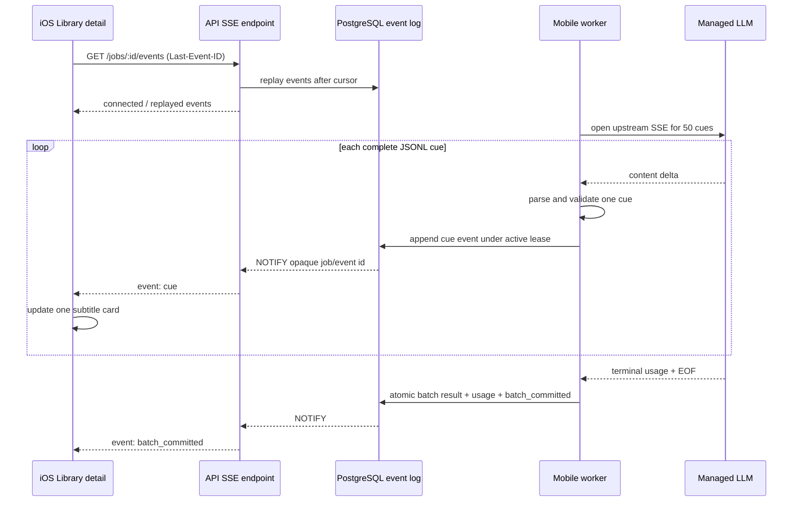

# Mobile Analysis Recoverable SSE Design

**Date:** 2026-08-12  
**Status:** Approved in conversation  
**Repositories:** `whatsub-mobile`, `whatsub-license`  
**Primary user outcome:** Mobile managed analysis reveals each fully parsed subtitle cue immediately while retaining server-side background execution, cancellation, retry, quota accounting, and reconnect recovery.

## 1. Context

Managed mobile analysis currently has two different streaming boundaries:

- `whatsub-license` already opens an upstream OpenAI-compatible SSE response.
- `MobileAnalysisWorker` buffers all generated content for one 50-cue phase, validates the whole JSONL response, commits it atomically, and only then exposes the batch through `GET /api/library/mobile-analysis/jobs/:id/results`.
- iOS polls that endpoint. The original English captions are available immediately, but translation and highlight fields advance in visible jumps of 50 cues.
- The desktop client parses complete JSONL objects from the LLM stream and publishes each valid cue as a preview while retaining a whole-batch durable commit boundary.

The mobile experience should match the desktop interaction: one complete cue appears as soon as its JSONL object is valid. It must not become token-by-token text animation.

The existing background-job behavior is a hard requirement. Switching apps, locking the phone, losing network access, or terminating the iOS process must not cancel server analysis. Returning to the app must recover missed cues without duplication.

## 2. Goals

1. Publish each complete, validated cue to the visible iOS Library detail view without waiting for the other cues in its 50-cue phase.
2. Keep the existing durable server job and four-worker production execution model.
3. Keep a 50-cue phase as the final validation, exact-once usage accounting, and durable result boundary.
4. Recover after iOS backgrounding, network loss, process termination, API restart, worker restart, and future horizontal worker/API scaling.
5. Remove previews produced by a failed or cancelled attempt so they never masquerade as durable results.
6. Preserve existing polling endpoints for old clients and as a new-client fallback.
7. Bound SSE connections, event retention, database work, and queue growth.
8. Surface approximate queue position and wait time instead of an indefinite “waiting for server” state.

## 3. Non-goals

- Do not stream individual text tokens or partially formed translations.
- Do not move managed LLM execution onto the iPhone.
- Do not make an iOS connection own the lifetime of a server job.
- Do not change the 50-cue prompt size in this feature.
- Do not weaken full-phase validation or terminal usage requirements.
- Do not bill preview rows. Usage remains recorded only when the exact leased phase wins final settlement.
- Do not remove `/results` polling or require old iOS builds to understand SSE.
- Do not automatically raise production concurrency without a canary and health checks.

## 4. Design summary

The system uses a durable event log plus PostgreSQL notifications:

1. The worker consumes upstream SSE incrementally.
2. Every complete JSONL cue is validated against the submitted cue and appended to `mobile_analysis_events` under the still-active lease and attempt.
3. The same transaction issues a payload-free wake-up through PostgreSQL `NOTIFY` containing only opaque job/event identifiers.
4. An authenticated SSE endpoint replays rows after the client cursor, then forwards newly committed rows as notifications arrive.
5. iOS merges `cue` events into the existing progressive overlay immediately.
6. Full phase output is still validated and committed atomically after upstream EOF and terminal usage.
7. A failed attempt appends `batch_reset` atomically with its retry transition. iOS removes only previews from that attempt.
8. A successful settlement appends `batch_committed` atomically with the durable result and usage ledger update.
9. Backgrounding closes only the phone’s SSE connection. The worker keeps running.



## 5. Backend event storage

### 5.1 Table

Add `mobile_analysis_events` in `whatsub-license/schema.sql`:

```sql
CREATE TABLE IF NOT EXISTS mobile_analysis_events (
  event_id BIGSERIAL PRIMARY KEY,
  job_id UUID NOT NULL REFERENCES mobile_analysis_jobs(id) ON DELETE CASCADE,
  event_type TEXT NOT NULL CHECK (
    event_type IN ('cue','batch_reset','batch_committed','phase','job_state')
  ),
  batch_index INTEGER,
  attempt INTEGER,
  cue_index INTEGER,
  payload_json JSONB NOT NULL,
  created_at BIGINT NOT NULL
);

CREATE INDEX IF NOT EXISTS idx_mobile_analysis_events_job_event
  ON mobile_analysis_events(job_id, event_id);

CREATE UNIQUE INDEX IF NOT EXISTS idx_mobile_analysis_events_unique_cue_attempt
  ON mobile_analysis_events(job_id, batch_index, attempt, cue_index)
  WHERE event_type = 'cue';

ALTER TABLE mobile_analysis_batches
  ADD COLUMN IF NOT EXISTS attempt_started_at BIGINT;

ALTER TABLE mobile_analysis_batches
  ADD COLUMN IF NOT EXISTS processing_ms BIGINT;

CREATE INDEX IF NOT EXISTS idx_mobile_analysis_batches_completed_phase
  ON mobile_analysis_batches(phase, completed_at DESC)
  WHERE completed_at IS NOT NULL;
```

The implementation may add focused check constraints for nullable/type-specific columns. Cue rows require `batch_index`, `attempt`, and `cue_index`; terminal job-state rows do not.

An event row stores only response data already authorized through the owning mobile-analysis job. It is never available through a public route. PostgreSQL notifications contain no subtitle text, email, title, or token usage.

### 5.2 Event retention

- Running jobs retain their complete event history.
- Terminal jobs retain events for at least 24 hours after `updated_at`.
- Daily cleanup deletes at most a bounded number of terminal jobs’ event rows per pass and relies on the `(job_id, event_id)` index.
- Heartbeats and `connected` frames are not persisted.
- Existing payload-pruning rules must not delete events for a non-terminal job.

### 5.3 Why rows, not a growing JSON blob

Appending one row per cue avoids repeatedly rewriting a large JSONB array, provides a natural replay cursor, supports indexed pagination, and gives retry/reset events an unambiguous order. With four workers, the expected write rate is small relative to PostgreSQL capacity.

## 6. Incremental upstream parsing

Refactor `consumeAnalysisSse` so cue phases can receive a callback whenever one complete JSONL line is available while preserving all existing stream protections:

- bounded response bytes;
- OpenAI-compatible SSE framing;
- terminal usage required;
- abort propagation;
- reader cancellation on parser failure;
- full response text or parsed-cue collection retained for final phase validation.

The incremental parser must handle arbitrary UTF-8 and transport boundaries. A JSON object may span multiple upstream SSE chunks. Only a complete newline-delimited object can be emitted.

For each complete cue line:

1. Parse JSON.
2. Validate the cue index, source text association, field types, and output bounds using the same rules as final parsing.
3. Reject duplicates or unexpected cue indices for the current submitted slice.
4. Append a `cue` event only if the exact job lease, batch attempt, and active status still match.
5. Continue accumulating enough state to run whole-phase validation at EOF.

Preview validation and final validation must share implementation rather than drift into two rule sets.

Cue persistence is ordered and bounded. The worker awaits each append instead of launching an unbounded promise per cue; normal stream backpressure absorbs the small database round trip. If preview storage suffers a transient database error while the exact lease is still active, the worker marks preview delivery degraded for that phase, stops further preview writes, and continues toward the authoritative whole-phase settlement. The user may see one 50-cue jump for that phase, but an additive preview failure must not by itself discard otherwise valid LLM work. A lease loss, conflicting duplicate, or cue-validation failure still aborts the attempt.

## 7. Lease-safe event writes

Preview publication is conditional, not best-effort truth.

`appendMobileAnalysisCueEvent(claim, cue)` must atomically verify:

- job status is `running`;
- `cancel_requested` is false;
- lease owner and lease expiry exactly match the claim;
- lease has not expired at the post-lock wall-clock sample;
- target batch is incomplete;
- target batch `attempts` equals the claim attempt;
- the cue belongs to that batch.

If any condition fails, it returns `lease_lost` and emits nothing. A late upstream stream therefore cannot publish after cancellation, retry, shutdown recovery, or another worker reclaim.

The unique cue-attempt index makes a duplicate callback idempotent. A conflicting payload for the same key is an internal parser/worker failure, not an overwrite.

## 8. Commit, retry, cancellation, and resume

### 8.1 Successful phase

At EOF, the worker still requires terminal usage and validates the complete 50-cue phase. `completeMobileAnalysisBatchAndRecordUsage` remains the exact-once transaction and additionally appends `batch_committed` before commit.

The event payload contains at least:

```json
{
  "batchIndex": 2,
  "attempt": 0,
  "completedCues": 150,
  "totalCues": 230
}
```

iOS marks matching previews durable without removing and reinserting visible rows. It may immediately fetch `/results` after this event to refresh the authoritative batch cursor.

### 8.2 Retryable failure

The transaction that increments `mobile_analysis_batches.attempts`, releases the lease, and assigns `next_run_at` also appends:

```json
{
  "event": "batch_reset",
  "batchIndex": 2,
  "attempt": 0,
  "reason": "retry"
}
```

The public payload does not expose internal upstream error text. iOS removes only uncommitted previews matching `(batchIndex, attempt)` and returns those cards to “等待 AI”. The next claim emits cue events with `attempt = 1`.

### 8.3 Non-retryable failure or exhausted retries

The failure transaction appends any required `batch_reset`, followed by a sanitized `job_state: failed`. Existing public error-code filtering remains authoritative.

### 8.4 Cancellation

Cancellation remains a server mutation independent of the SSE connection. Its transaction:

1. requests cancellation / transitions the job according to existing rules;
2. appends `batch_reset` for an active uncommitted attempt when previews exist;
3. appends `job_state: cancelled`.

Committed batches stay visible. Uncommitted previews disappear.

### 8.5 Resume

Resume resets the unfinished phase using the existing attempt policy and appends `job_state: queued`. The first incomplete batch is parsed again. Old reset attempts remain in the event log so replay produces the same final overlay state.

## 9. SSE endpoint

Add:

```text
GET /api/library/mobile-analysis/jobs/:id/events
```

### 9.1 Authentication and ownership

- Require the existing bearer session.
- Resolve the job by `(id, owner_email)` before opening a stream.
- Return 404 for a missing or foreign job.
- Parse `Last-Event-ID` as a non-negative safe integer. An explicit query cursor may be supported for testability, but the header is canonical.
- Never place bearer tokens or cursors in logs.

### 9.2 Response headers

```http
Content-Type: text/event-stream; charset=utf-8
Cache-Control: no-cache, no-transform
X-Accel-Buffering: no
Connection: keep-alive
```

Nginx and any Aliyun proxy/CDN path must disable response buffering for this endpoint and permit an idle period longer than the 15-second heartbeat.

### 9.3 Event frames

All `data` values are compact single-line JSON. Event names are server constants.

| Event | Persisted | Purpose |
|---|---:|---|
| `connected` | No | Current job view, total cues, latest event ID, reconnect mode |
| `snapshot` | No | First connection/process-relaunch reconstruction of active previews |
| `cue` | Yes | One complete validated cue |
| `batch_committed` | Yes | Preview attempt became durable |
| `batch_reset` | Yes | Remove one uncommitted attempt |
| `phase` | Yes | `cues`, `summary`, or `finalizing` presentation |
| `job_state` | Yes | `queued`, `running`, `paused_quota`, `cancelled`, `failed`, `completed` |
| `resync` | No | Event history unavailable; hydrate `/results` and request snapshot |

Every persisted frame uses its database `event_id` as the SSE `id`.

Example:

```text
id: 1842
event: cue
data: {"batchIndex":2,"attempt":0,"cueIndex":113,"cue":{...}}

```

The server sends `retry: 2000` on connection and `: ping` every 15 seconds.

### 9.4 Snapshot and replay modes

Two reconnection modes prevent cursor/overlay mismatch:

- **Transient reconnect in the same view session:** iOS still owns its preview overlay and sends `Last-Event-ID`. The server replays later persisted events, then follows live events.
- **Cold app/view start:** iOS first hydrates durable `/results`, then requests a stream snapshot. The server reconstructs only the currently active uncommitted attempt from event rows and emits it with the latest cursor before following live events.

iOS must never persist a cursor without the corresponding preview state. A cold start therefore uses snapshot mode rather than trusting a stale cursor from `UserDefaults`.

If the requested cursor predates retained history or cannot produce a coherent attempt state, send `resync` and close normally.

### 9.5 Race-free live handoff

Each API process owns one dedicated PostgreSQL `LISTEN mobile_analysis_events` connection and an in-process dispatcher for its local SSE subscribers. It does not allocate one database listener per phone connection.

Connection handoff order:

1. Register the local job subscriber.
2. Query/replay rows after the cursor.
3. On every relevant notification, query rows after the last delivered ID.

Duplicates caused by replay/notification overlap are harmless because `event_id` is the client and server cursor. If the PostgreSQL listener reconnects, the dispatcher rescans all locally subscribed job IDs from their cursors. Durable rows, not `NOTIFY`, are the source of truth.

This design works when workers and API endpoints later run in separate containers or hosts.

## 10. Connection admission and abuse bounds

Add validated runtime limits with conservative production defaults:

- `MOBILE_ANALYSIS_SSE_CONNECTIONS=256` globally;
- `MOBILE_ANALYSIS_SSE_OWNER_MAX=3` per authenticated account;
- one active stream per job per iOS view session;
- bounded connection-open rate per account/IP using the existing rate-limit style;
- replay pages capped (for example, 200 events per database read);
- maximum events remain bounded by the existing 12,000-cue job limit plus state events.

If the SSE admission cap is reached, return 429 with `Retry-After`. iOS silently uses `/results` polling. SSE admission must never cancel or pause the durable job.

## 11. iOS client design

### 11.1 Client API

Extend `ManagedAnalysisClientProtocol` with an async event stream abstraction, implemented using `URLSession` bytes or a data delegate:

```swift
func events(
    id: String,
    afterEventID: Int64?,
    mode: ManagedAnalysisStreamMode,
    token: String
) -> AsyncThrowingStream<ManagedAnalysisEvent, Error>
```

The SSE parser must support arbitrary network chunk boundaries, CRLF/LF, comments, `retry`, `id`, `event`, and multi-line `data` joining even though the server emits single-line JSON.

### 11.2 Overlay state

Track preview identity separately from durable results:

```text
(batchIndex, attempt, cueIndex) -> parsed cue
```

- `cue`: merge the generated fields into the immutable English baseline and update visible progress by one distinct cue.
- duplicate `eventId`: ignore.
- lower/out-of-order `eventId`: reject or ignore without rewinding.
- `batch_reset`: remove matching preview identities and restore baseline fields.
- `batch_committed`: promote matching previews; fetch the authoritative result page without visual flicker.
- `job_state: completed`: fetch the final Library entry using the existing final-sync path.

Displayed progress is the union of committed cue indices and active preview cue indices, never `completedBatches * 50 + raw event count`.

### 11.3 Lifecycle

- Detail view visible and job active: maintain SSE.
- App enters background: cancel only the HTTP stream and flush the in-memory cursor/overlay relationship for that view session.
- App returns: hydrate durable results, request a snapshot, then follow live events.
- Detail view disappears: close SSE; server job continues.
- Cancellation/resume actions remain ordinary authenticated HTTP mutations.
- Completion notification remains APNs/Live Activity best effort.

### 11.4 Reconnect and polling fallback

- Transient failures use 1, 2, 4, 8, then 15-second bounded backoff while foregrounded.
- A protocol/auth/404 error uses the existing error presentation rather than looping.
- Three consecutive transport failures switch the current session to existing polling behavior.
- Polling mode may retry SSE after 30 seconds or at the next foreground transition.
- A backend without the new endpoint (404) is treated as an old compatible backend and polls without user-facing failure.

## 12. Queue fairness and wait experience

### 12.1 Existing fairness retained

Production currently runs four workers. The scheduler already prevents one long video or account from monopolizing them:

- one leased job per owner at a time;
- each worker turn processes only one 50-cue phase;
- successful settlement releases the lease and updates `last_served_at`;
- the next claim orders by readiness and fair-service timestamps;
- each owner may queue at most three jobs;
- the global durable queue is capped at 100.

No scheduler rewrite is required for the initial SSE release.

### 12.2 Queue fields

Extend the public job/SSE connected view with optional approximate fields:

```json
{
  "jobsAhead": 7,
  "estimatedStartSeconds": 25
}
```

The database computes `jobsAhead` from runnable jobs ordered using the same scheduling keys. ETA uses a bounded rolling service-time estimate from recent completed cue phases and the configured worker count. It is explicitly approximate and omitted when there are insufficient samples.

On every claim, `attempt_started_at` is set to the claim time. Successful settlement stores `processing_ms = completed_at - attempt_started_at`; a retry overwrites the start time on its next claim. ETA reads the median of at most the latest 100 completed cue phases. This deliberately measures active worker service rather than time spent waiting in the durable queue. Summary/finalization samples are excluded.

iOS presentation:

- `jobsAhead == 0`: “即将开始解析”;
- known ETA: “排队中 · 前方约 N 个任务 · 预计 X 分钟开始”;
- unknown ETA: “排队中 · 前方约 N 个任务”.

Queue estimates never affect claim order or correctness.

### 12.3 Saturation behavior

The 100-job limit is a safety bound, not a user-experience target. If creation returns `queue_limit`/429:

- retain the prepared managed-analysis request locally in a bounded pending-submission cache;
- retry with server `Retry-After` and exponential backoff while policy still permits managed analysis;
- preserve the idempotency key;
- show a cancellable “服务器繁忙，已等待自动提交” state;
- never open multiple duplicate jobs.

Pending submission storage is encrypted/protected using normal iOS file protection, bounded to the existing request-size limit, and removed after success, user cancellation, logout, or expiry.

## 13. Capacity and scaling policy

### 13.1 Production baseline observed on 2026-08-12

- ECS: 2 vCPU, about 3.5 GiB RAM, about 2.5 GiB available at inspection.
- `whatsub-license`: approximately 70–80 MiB RSS.
- Four mobile workers, eight background LLM slots, 32 total LLM slots.
- One background active request per owner.
- Recent process telemetry: request duration p50 about 11 s, p95 about 31 s; first token p50 about 105 ms; event-loop p95 about 20 ms; no recent admission rejection, upstream 429, or upstream 5xx in the inspected sample.
- Durable mobile queue was empty at inspection.

These are a small-sample operational baseline, not a capacity guarantee.

### 13.2 SSE cost

SSE does not add LLM calls. A typical 300-cue video adds roughly 300 small event inserts and one visible downstream text stream. At four workers this is expected to be tens, not thousands, of writes per second. Heartbeats are not stored.

### 13.3 Scale triggers

Add/retain telemetry for:

- durable queue depth;
- oldest queued age;
- estimated-start p50/p95;
- active SSE connections and replay lag;
- event insert failures;
- active/queued LLM permits;
- upstream 429/5xx/network errors;
- process RSS, CPU, event-loop p95, and open file descriptors.

Operational progression:

1. Ship at four workers.
2. If oldest queued age remains above two minutes, canary six workers for 30 minutes.
3. If healthy but queue delay remains high, canary eight workers.
4. Require CPU below 80%, RSS below 500 MiB, event-loop p95 below 100 ms, file descriptors below 1024, and acceptably low upstream 429/error rates before keeping an increase.
5. If eight workers are insufficient, add worker replicas instead of exceeding validated per-process limits. PostgreSQL leases, `SKIP LOCKED`, durable events, and `LISTEN/NOTIFY` support this topology.

Concurrency changes remain explicit operational actions, not automatic self-modification by the app.

## 14. Compatibility and rollout

1. Add schema, event APIs, parser hooks, tests, Nginx SSE configuration, and event emission behind a backend runtime flag.
2. Deploy backend first with the endpoint additive and polling unchanged.
3. Verify public-domain streaming with a fake delayed upstream: first cue must arrive before phase EOF and no proxy buffering may occur.
4. Enable event emission with four workers and monitor for at least 30 minutes.
5. Ship iOS TestFlight using SSE with polling fallback.
6. Observe queue, event, connection, resource, and upstream telemetry.
7. Roll back by disabling SSE event emission/endpoint use; durable jobs and `/results` continue working.

Old clients are unaffected. A new client talking to an old backend receives 404 and polls.

## 15. Testing strategy

### 15.1 Backend parser tests

- JSONL cue split across arbitrary SSE and UTF-8 byte boundaries.
- Multiple cues in one upstream delta.
- CRLF/LF and final line behavior.
- Duplicate, missing, out-of-range, malformed, and mismatched cues.
- Preview callback followed by final whole-phase validation.
- byte ceiling, terminal usage, cancellation, timeout, and reader cleanup remain enforced.

### 15.2 Backend database/worker tests

- cue event append succeeds only under the exact active lease/attempt.
- duplicate callback is idempotent; conflicting duplicate fails closed.
- cancellation and lease loss prevent late preview publication.
- retry transition and `batch_reset` are atomic.
- batch result, usage ledger, and `batch_committed` are atomic.
- failed final settlement cannot bill or commit events twice.
- per-owner job exclusion and batch-level fairness remain intact.
- retention cleanup is bounded and does not touch running jobs.

### 15.3 Backend route tests

- authentication, foreign-job 404, cursor validation, connection caps, and retry headers.
- replay ordering and pagination.
- replay/live handoff race produces no missing events.
- PostgreSQL listener reconnect triggers subscriber rescan.
- snapshot reconstructs only the current uncommitted attempt.
- retained-history gap produces `resync`.
- heartbeat is not persisted.

### 15.4 iOS tests

- SSE framing across arbitrary data chunks.
- event decoding, event-ID deduplication, and ordering.
- cue merge, batch reset, commit promotion, and progress union.
- foreground reconnect replay and cold-start snapshot.
- app background closes stream without issuing job cancellation.
- repeated transport failures fall back to polling.
- 404 old-backend compatibility.
- terminal completion uses the existing final Library refresh path.
- pending queue submission preserves idempotency and cancels cleanly.

### 15.5 Integration and rollout checks

- Fake upstream emits one valid cue every fixed interval; public API delivers each before the 50-cue EOF.
- Disconnect, emit more cues, reconnect, and verify exact replay.
- Restart API listener while worker continues; verify rescan recovery.
- Restart/reclaim worker mid-phase; verify reset before new-attempt cues.
- Exercise Nginx and Aliyun public-domain path with buffering disabled.
- Run existing backend suite and iOS CI in addition to new tests.

## 16. Acceptance criteria

The feature is complete when:

1. A foreground iOS detail view visibly gains one fully parsed cue at a time.
2. No partial JSON or token-level text is shown.
3. Backgrounding or disconnecting iOS does not stop the worker.
4. Foreground return recovers missed cues without duplicates.
5. Failed/cancelled attempt previews are removed and committed results remain.
6. Usage is recorded exactly once only at successful phase settlement.
7. Old iOS clients continue polling successfully.
8. New iOS clients fall back to polling when SSE is unavailable or capped.
9. One account cannot monopolize workers or SSE connections.
10. Public-domain delivery is demonstrably unbuffered.
11. Backend and iOS test suites pass, and production health remains inside the defined thresholds.
